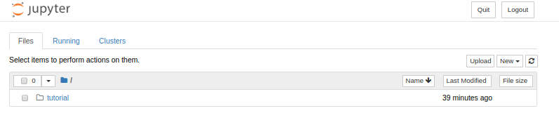
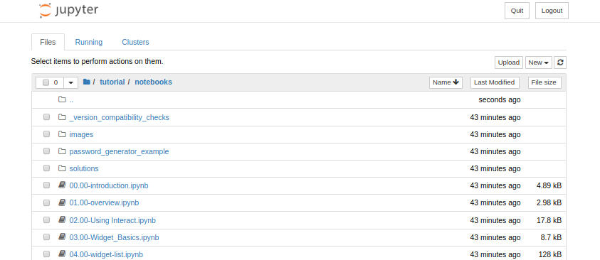

# Docker image for the [Jupyter Widget Ecosystem Tutorial](https://github.com/jupyter-widgets/tutorial)
## [https://github.com/jupyter-widgets/tutorial](https://github.com/jupyter-widgets/tutorial)
The Docker image is build from the [continuumio/miniconda3](https://hub.docker.com/r/continuumio/miniconda3/) docker image and follows the installation procedure provided by [jupyter-widgets/tutorial](https://github.com/jupyter-widgets/tutorial).
## How to use this image
### Start the Container
Pull the image using:
```
docker pull jdmitz/jupyter_tutorial:latest
```
Run the image using the jupyter_tutorial notebooks included in the image on port 8888 of the local machine
```
docker run -it --name jupyter-tutorial -p 8888:8888 jdmitz/jupyter_tutorial:latest
```
If port 8888 on the local machine is already in use change the first port number in the command (-p <strong>8888</strong>:8888) to another port number (e.g. -p <strong>8080</strong>:8888).

If you wish to modify the jupyter_tutorial notebooks and save the modified versions, clone the jupyter_tutorial repository into the directory you start the image from and use the following command.
```
docker run --name jupyter-tutorial -p 8888:8888 \
    -v "$(pwd)"/tutorial:/opt/notebooks/tutorial \
    jdmitz/jupyter_tutorial:latest
```
### Accessing the Notebooks
Once the image is started you will notice something similar to the following in the container output.
```
The Jupyter Notebook is running at:
http://(e4105530adef or 127.0.0.1):8888/?token=f486f3cfe409cf3b8daef46b7adf87f4558930506b5702b3
```
Open a browser and point the browser at the URL:
```
http://localhost/8888/?token=[SECURITY TOKEN]
```
The ```[SECURITY TOKEN]``` of the URL should be copied from the container output.

If you needed to change the port in the run command you will need to use that port number in the URL as well.

You should see something like the following:


Navigating to the /tutorial/notebooks directory will show the following:


Enjoy!
